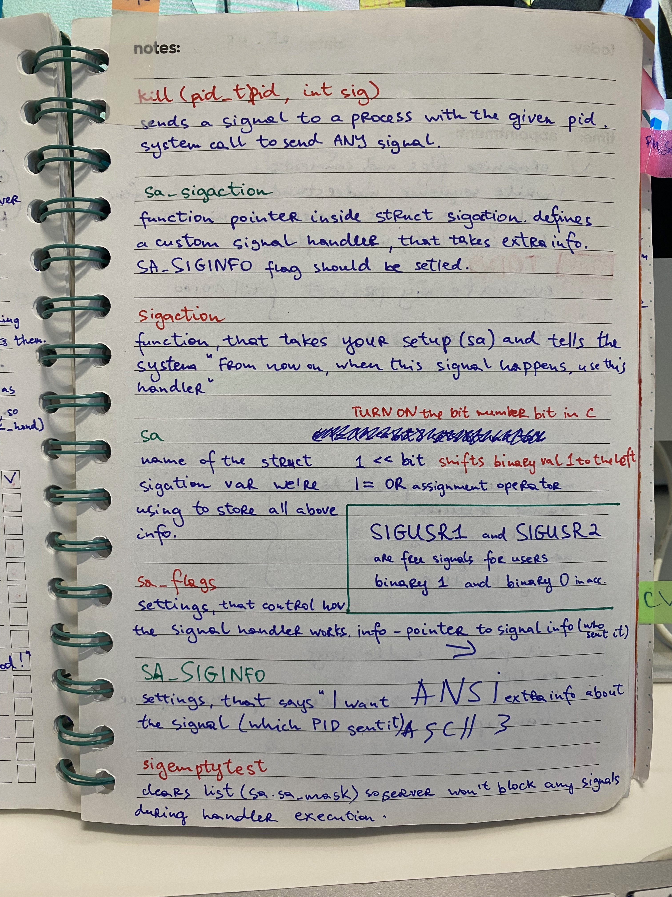

# 📨 Minitalk

## 📌 Purpose
Minitalk demonstrates **Unix signal-based communication**.  
The client sends a string to the server by converting each character into bits.  
The server then reconstructs the message from those bits.  

---

## 🔗 Communication
Since only two signals are available, we map them as:  
- `SIGUSR1` → binary `1`  
- `SIGUSR2` → binary `0`  

This allows us to send any character **bit by bit**.  

---

## 🖥️ Server
- Sets up **signal handlers** to catch incoming bits.  
- Uses **static variables** to rebuild characters bit by bit.  
- Prints the reconstructed characters.  
- *(Bonus)* acknowledges the end of the message using `kill()`.  

---

## 💻 Client
- Takes each character and breaks it into bits.  
- Sends each bit as a signal using `send_char`.  
- The server replies with an acknowledgment.  
- The client prints a small confirmation message when receiving acknowledgment signals (`SIGUSR1`, `ack_hand`).  

---

## 📊 How it Works

+---------+ SIGUSR1 / SIGUSR2 +---------+

| Client | -----------------------------> | Server |

| |||||||||   |

| send | | rebuild |

| bits | | chars |

+---------+ +---------+

^ |
|  v

| acknowledgment (kill) |

+------------------------------------------+

[Understanding minitalk by Laura:](https://42-cursus.gitbook.io/guide/2-rank-02/minitalk/understand-minitalk)

